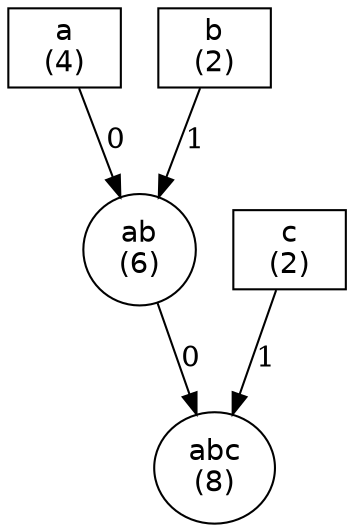

# Huffman Coding in Java

This program encodes and decodes files using the Huffman coding algorithm. It allows you to compress and decompress text
files by creating efficient variable-length codes based on character frequencies.

## Features

- **File Encoding**: Compress a file using Huffman coding.
- **File Decoding**: Decompress a file that has been encoded with Huffman coding.
- **Command-Line Arguments**: Control the program via command-line arguments.
- **Color-Coded Console Output**: Uses colors for better readability and debugging.

## Algorithm

Here’s a simplified explanation of the Huffman coding algorithm and the structure of the encoded file in Markdown
format:

# Huffman Coding: File Encoding and Decoding

## How Huffman Coding Works

Huffman coding is a lossless data compression technique where characters are assigned shorter binary codes
based on their frequency in the input file. More frequent characters get shorter codes.

### Encoding Process

1. **Analyze Character Frequencies**:
   The first step is to calculate how often each character appears in the input file.
2. **Build the Huffman Tree**:
   Using the frequencies, a tree is built where:

    - The least frequent characters are combined first.
    - Each left branch is labeled `0` and each right branch is labeled `1`.
3. **Generate Huffman Codes**:
   Starting from the root, each character is assigned a binary code based on the path to
   its node  (left is `0`, right is `1`).
4. **Encode the File**:
   Each character in the input file is replaced with its Huffman code to create the encoded data.
5. **Write the Encoded File**:
   The Huffman dictionary (mapping characters to their codes) and the encoded data are saved to the output file.

### Decoding Process

1. **Read the Huffman Dictionary**:
   The encoded file contains the dictionary that tells the decoder how to translate the binary codes back into
   characters.
2. **Decode the Data**:
   The binary data is read and translated into characters using the dictionary.

---

## Structure of the Encoded File

The encoded file contains two parts:

1. **Huffman Dictionary**:
   This part maps each character to its corresponding Huffman code.
   It includes:

    - The number of unique characters.
    - For each character, its Huffman code.
        - e.g., `a` -> `00`, `b` -> `01`, `c` -> `10`, etc.
2. **Encoded Data**:
   This is the content of the original file, where each character is replaced by its Huffman code.
   e.g., `00 01 01 10 10 11`

### Special Case: Single Unique Character

#### If the input file contains only one unique character, the file structure simplifies:

- This made for 2 reasons:
    - The Huffman dictionary is not needed for a single character.
    - It's more efficient to store the single character directly in the file.

---

## Example of Encoded File Structure

### Example 1: File with Multiple Characters (`aaaabbcc`)

For the input `aaaabbcc`, Huffman tree would look like this:



and the encoded file structure would look like this:

`3`       (Number of unique characters)
`a`       (Character ‘a’)
`00`      (Huffman code for ‘a’)
`b`     (Character ‘b’)
`01`      (Huffman code for ‘b’)
`c`       (Character ‘c’)
`10`      (Huffman code for ‘c’)
`000000000101010110110` (Encoded data)

### Example 2: File with One Character (`aaaa`)

For the input `aaaa`, the encoded file structure would be:

`1`       (Number of unique characters)
`a`       (Character ‘a’)
(Empty Huffman code)
`1111`    (The content, as-is)

---

## Summary

The encoded file consists of:

1. **Huffman Dictionary**: Maps each character to its Huffman code.
2. **Encoded Data**: The original content, where each character is replaced by its Huffman code.

If there is only one character in the file, the structure is simplified to just the character and its repeated content.
This makes the encoding efficient even for simple cases.

This Markdown version provides a simplified overview of the Huffman coding algorithm and the structure of the encoded
file. It breaks down the process in easy-to-understand terms and uses clear examples for better comprehension.

## Usage

### Command-Line Arguments

- **`-m`**: Display information about the program and how to use it.
- **`-c`**: Encode a file using Huffman coding.
- **`-d`**: Decode a file that was encoded using Huffman coding.

### Syntax

```shell
java App.java -c/-d {inputFile} {outputFile}
```

Where:

- **`-c`**: For encoding a file.
- **`-d`**: For decoding a file.
- **`{inputFile}`**: The input file to encode or decode.
- **`{outputFile}`**: The output file for the encoded or decoded result.

### Example Usage

#### Encoding a File:

To encode a file called `input.txt` and output the encoded file as `encoded.txt`:

```shell
java App.java -c input.txt encoded.txt
```

#### Decoding a File:

To decode an encoded file `encoded.txt` and output the result as `decoded.txt`:

```shell
java App.java -d encoded.txt decoded.txt
```

#### Displaying Program Information:

To display information about the program:

```shell
java App.java -m
```

## Color-Coded Output

The program outputs color-coded messages for better clarity:

- **Green**: Success messages (e.g., encoding/decoding completed).
- **Blue**: Informational messages (e.g., file names).
- **Yellow**: Highlighted file paths.
- **Red**: Error messages.

For example:

- **Green** indicates successful encoding/decoding.
- **Blue** is used to show the file names.
- **Red** is used for error messages.

## Requirements

- **Java 8+**: Ensure that you have Java installed (JDK 8 or higher).
- **zsh**: The program execution code is written in `zsh`.
